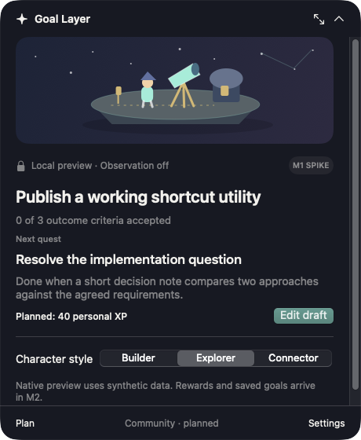

# Goal Layer

Goal Layer is a macOS companion that turns accepted progress toward a chosen goal into a small, persistent floating observatory. Its proposed loop is: define an outcome, approve a practical quest, do the work, confirm what changed, and develop the world.

The standalone foundation is prepared locally. A synthetic native overlay spike has been built and launched on the available Mac, with expansion/Escape, draft entry, display pinning/restart, and enlarged-text checks. M1 remains in development; its full native acceptance gates are pending. This is not a released personal productivity app. The public source repository is [mrrkrieg/goal-layer](https://github.com/mrrkrieg/goal-layer); the reviewed source is pushed to its public main branch. There is no downloadable beta or notarized distribution.

| Capability | Current status |
| --- | --- |
| Product, interaction, scoring, architecture, and contributor contracts | Available as documentation |
| M0 implementation decisions and environment inventory | Recorded in [Decisions](docs/DECISIONS.md) |
| Native top pill, expandable panel, observatory preview, menu access | Synthetic M1 spike; initial build/launch and expansion/Escape observations, full acceptance pending |
| Manual goals, approved quests, evidence, deterministic XP, persistence, world placement | Planned for M2 |
| Optional AI planning and assessment | Planned for M3 |
| Optional app and browser context | Planned for M4 |
| Narrow source verification and consented pilot | Planned for M5 |
| Invite communities, chat, selected sharing, challenge leaderboard | Planned for M6 |
| Public beta packaging and distribution | Planned for M7 |



Read [current status and pending gates](docs/STATUS.md) before treating any behavior as supported. The original specifications retain their initial documentation-only status statements; the status record describes implementation work since that handoff.

## Development environment

The environment inspected on October 3, 2026 is macOS 26.5 (25F71), arm64, Apple Swift 6.0.3 (`swiftlang-6.0.3.1.10`, `clang-1600.0.30.1`), and the macOS 15.2 SDK supplied by Command Line Tools. Full Xcode is unavailable. The M1 route uses a SwiftPM executable wrapped in a native `.app` bundle by a shell script. See [ADR-001](docs/DECISIONS.md#adr-001-native-build-route-and-toolchain).

macOS 14 is the intended deployment target, not a tested support claim. macOS 26.5 is the only OS currently available for native testing. Minimum-OS, previous-OS, Intel, and additional hardware validation remain unverified.

From the project root, the M1 development entry points are:

```sh
./scripts/build-app.sh
./scripts/test.sh
open build/Goal\ Layer.app --args --demo
```

These commands describe the implementation route; fresh-checkout builds, 16/16 assertions, and CI passed; exact scope and results are in [Status](docs/STATUS.md) and the milestone evidence. `swift test --scratch-path .build --disable-sandbox` failed in this Command Line Tools environment because XCTest is unavailable (`no such module XCTest`). `scripts/test.sh` runs the deterministic standalone `GoalLayerChecks` executable instead; geometry checks do not replace native interaction testing.

The demo is a synthetic native interaction spike. It does not create real goals, award persistent XP, observe activity, or communicate with an AI provider or community. It needs no account, API key, model, server, browser extension, or observation permission. Its interaction claims remain subject to the M1 walkthrough. The [M1 QA procedure](docs/M1_QA.md) documents the temporary typing helper and scoped measurement tools.

M1 retains menu-bar access when the floating surface is hidden. The intended fullscreen fallback hides the floating surface and retains menu access; native fullscreen behavior remains unverified. No global shortcut is registered initially. Click and menu access are the initial entry points.

## Product and privacy boundaries

Real goal progress, personal XP, and shared challenge points are separate measurements. Personal XP follows accepted, frozen quest allocations; time, clicks, typing, browsing, prompts, and community engagement do not independently award it. AI recommendations cannot accept completions or write the reward ledger. Source confirmation proves only its named predicate. The canonical policy is in [Scoring](docs/SCORING.md).

M1 uses synthetic in-memory presentation data plus a local display preference. Pointer events serve native dismissal and hit testing only; they are not retained. It has no goal-activity observation or network integration. Opt-in QA diagnostics compare only the known synthetic typing helper’s frontmost identity and record booleans; they do not record other app identities or content. The complete manual offline workflow is an M2 requirement. Later observation, AI transmission, community membership, and public sharing each require their own explicit scope. Joining a community must not expose personal goals or evidence. Personal XP must never be used as a competitive community total. Planned collection, pause, retention, deletion, and local-only rules are in [Architecture](docs/ARCHITECTURE.md) and [Security](SECURITY.md).

## Contributing

The next incomplete milestone is M1: demonstrate native focus, dismissal, pointer bounds, display placement, fullscreen fallback, accessibility, and resource use on actual Macs. M2 begins after those dependencies are satisfied. Review [Contributing](CONTRIBUTING.md), [AGENTS.md](AGENTS.md), and the [Roadmap](docs/ROADMAP.md) before changing a contract or claiming a milestone is complete.

| Document | Authority |
| --- | --- |
| [Product specification](docs/PRODUCT_SPEC.md) | Goal model, personal loop, scope |
| [UX specification](docs/UX_SPEC.md) | Surfaces, world, focus, accessibility, copy |
| [Scoring](docs/SCORING.md) | Rewards, provenance, caps, duplicate work, reversals |
| [Architecture](docs/ARCHITECTURE.md) | Modules, storage, permissions, data boundaries |
| [Roadmap](docs/ROADMAP.md) | Milestone identifiers, dependencies, acceptance gates |
| [Decisions](docs/DECISIONS.md) | Concrete implementation decisions and open owners |
| [Status](docs/STATUS.md) | Actual environment, scope review, evidence, remaining work |
| [Open-source plan](docs/OPEN_SOURCE.md) | Separate source publication and binary-release gates |
| [Synthetic worked goal](examples/goal-plan.json) | Design fixture to trace into M2; not a runtime schema |

Original material is licensed under [MIT](LICENSE), with attribution to Goal Layer contributors. External material retains its own terms; see [Third-party notices](THIRD_PARTY_NOTICES.md). Follow the [Code of conduct](CODE_OF_CONDUCT.md). Vulnerability reporting setup and its current limitation are documented in [Security](SECURITY.md).
